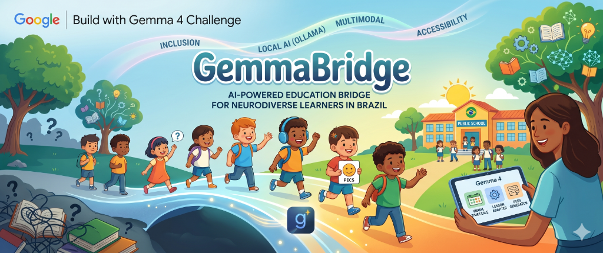

# GemmaBridge: AI Bridging the Inclusion Gap for Neurodiverse Learners 🌉

[](https://dev.to/challenges/google-gemma-2026-05-06)
[](https://reactjs.org/)
[](https://tailwindcss.com/)

> **A local-first, multimodal AI assistant designed to democratize inclusive education and bridge the communication gap for neurodiverse students in Brazil and beyond.**

## 📖 Overview

By 2026, the number of neurodivergent students—specifically those on the autism spectrum—enrolled in basic education has grown significantly. However, true inclusion is hindered by structural inequality, lack of specialized educators (AEE), and rigid communication tools.

**GemmaBridge** acts as a local, on-device co-pilot for educators. Powered by **Gemma 4 E2B**, it replaces static, physically printed communication cards with dynamic, AI-generated visual support that adapts to the immediate needs of non-verbal students.

## ✨ Key Features

*   **Smart PECS Generator:** Translates complex classroom situations (e.g., sensory overload) into instant, context-aware 4-option Picture Exchange Communication System (PECS) boards.
*   **Dynamic Lesson Adaptor:** Analyzes standard lesson plans and suggests autism-friendly adaptations, such as sensory breaks and simplified instructions.
*   **Offline-First & Privacy-Focused:** Runs entirely locally on the teacher's device. Sensitive student data and behavioral profiles never leave the hardware, ensuring maximum privacy.
*   **Hardware Efficient:** Designed to run on low-end educational devices (4GB-6GB RAM) common in public school systems.

## 🧠 How it uses Gemma 4

We leverage the **Gemma 4 E2B** model as the intelligent core of GemmaBridge:
1.  **Context-Aware Reasoning:** Uses the massive 128K context window to understand deep behavioral profiles and generate personalized interventions.
2.  **Local Inference:** Processes qualitative descriptions into structured visual boards locally, bypassing cloud latency and internet dependency.
3.  **Efficiency:** Optimized for edge computing, enabling state-of-the-art LLM capabilities on standard school laptops without requiring external GPUs.

## 🚀 Getting Started

### Prerequisites
*   **Node.js**: v18.17.0 or higher
*   **npm**: v9.0.0 or higher
*   **Web Browser**: Chrome, Edge, or Firefox (Modern versions)

### Local Setup

1. **Clone the repository**
   ```bash
   git clone https://github.com/vfcarida/GemmaBridge.git
   cd GemmaBridge
   ```

2. **Install dependencies**
   ```bash
   npm install
   ```

3. **Run the development server**
   ```bash
   npm run dev
   ```

4. **Access the application**
   Open [http://localhost:3000](http://localhost:3000) in your browser.

## 🎥 Demo
Check out our demo video: [GemmaBridge Demo](https://youtu.be/oc3elLErydQ)

## 🛠️ Built With
*   [Next.js 15](https://nextjs.org/) - Frontend Framework
*   [Tailwind CSS](https://tailwindcss.com/) - UI Styling
*   [Lucide React](https://lucide.dev/) - Iconography
*   [Gemma 4 E2B](https://ai.google.dev/gemma) - Local LLM Engine

---
Built with ❤️ for the Dev.to Google Gemma 4 Challenge.
